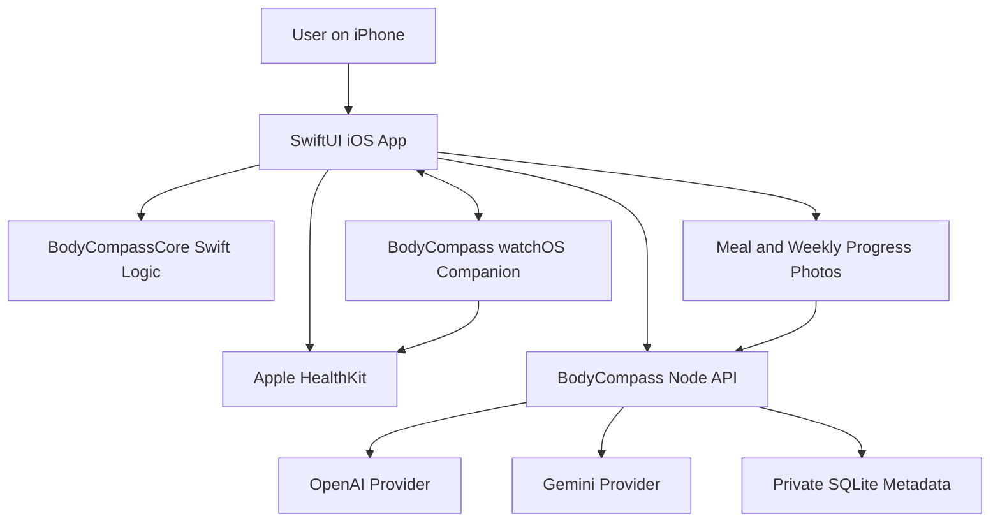

# Architecture

## High-Level Shape

## iOS App

Path: `ios/BodyCompass`

Responsibilities:

- SwiftUI screens and navigation.
- HealthKit authorization and metric reads.
- Camera/photo picker for meals and standardized weekly progress check-ins.
- Local user state and manual fallback inputs.
- Versioned weekly routine, session logging, and pending coach-change proposals.
- Sync routine/session data with the offline-capable watchOS companion.
- Display AI comparison and reconciled recommendations.
- Persist Coach exchanges locally and validate AI routine instructions before creating pending proposals.

Current app tabs:

- Today
- Meals
- Goal
- History
- Coach

## Apple Watch and Apple Workout (In Progress)

- Apple Workout exclusively owns active strength/swimming lifecycle and sensor metrics.
- WorkoutKit creates, schedules, and opens BodyCompass plans in Apple Workout.
- Watch Connectivity transfers routine versions, setup context, queued logs, and background updates.
- HealthKit maps completed Apple workouts back by WorkoutPlan/session UUID.
- Watch remains functional offline and reconciles logs idempotently after reconnecting.

Implemented now: Watch Connectivity transfers routine/history and durable manual logs. WorkoutKit maps strength and Pool/Open Water swims, schedules from iPhone, and opens Apple Workout from Watch. Structured strength uses a runtime-supported custom plan or open Traditional Strength Training fallback. Completed HealthKit workouts match the BodyCompass session UUID and expose duration, energy, and swimming distance. BodyCompass no longer starts a parallel workout session or mirrors lifecycle.

## Swift Core

Path: `ios/BodyCompass/Sources/BodyCompassCore`

Responsibilities:

- Body profile model.
- Daily health snapshot model.
- Meal analysis model.
- Provider estimate bundle and corrected meal-history model.
- 12% body-fat goal projection logic.

This code should stay pure and testable. Do not add HealthKit, network calls, or UI dependencies here.

## Backend

Path: `server`

Responsibilities:

- Keep OpenAI and Gemini API keys server-side.
- Analyze meals through both providers.
- Compare weekly progress photos through both providers using health trends as context.
- Create combined Coach answers with bounded user context and deterministic safety routing.
- Validate and reconcile structured training-plan proposals without activating them.
- Accept health snapshots and future persisted logs.
- Persist accepted result metadata in SQLite; never persist meal or progress photos.
- Authenticate the configured private owner, export their data, and delete relational records.
- Calculate or mirror goal projections for API clients.
- Expose liveness/readiness probes, validate production configuration, and shut down cleanly.

Current backend is dependency-light Node using `node:http`. Add dependencies only when they clearly help.

## Persistence

Current state:

- SQLite persists users, profiles, health snapshots, schedules, accepted meals, Coach exchanges, and progress check-ins in WAL mode.
- Meal and progress photos exist only in the capture UI and transient provider-analysis request. They are not written to iOS history, SQLite, backup, or export.
- iOS remains local-first with `UserDefaults` result metadata, then asynchronously backs up accepted records without images.
- A bearer token is optional for local private mode, required in production, and stored in iOS Keychain.

Deployment-ready operations:

- A non-root Node container mounts durable SQLite storage at `/data` and exposes separate liveness/readiness probes.
- Backup creates a consistent SQLite snapshot plus photo-free checksum manifest; restore verifies checksum and integrity and preserves the previous database.
- Actual HTTPS hosting, production secret setup, and a host-level restore drill remain Phase 9D execution work.
- Managed relational storage is considered only when deployment scale justifies replacing the single-instance SQLite adapter.
- Multi-user identity only if BodyCompass becomes more than a private single-user app.

## Important Boundary

Never put OpenAI or Gemini API keys in the iOS app. All provider calls must go through `server`.

Progress photos are sensitive user data. Strip metadata before upload, avoid including the face where possible, never expose public URLs, and never persist them in BodyCompass history or backup.
