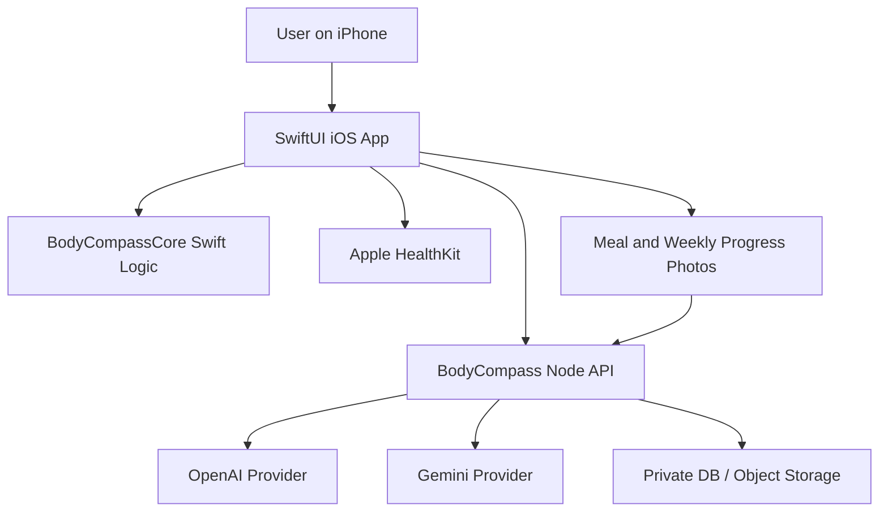

# Architecture

## High-Level Shape

## iOS App

Path: `ios/BodyCompass`

Responsibilities:

- SwiftUI screens and navigation.
- HealthKit authorization and metric reads.
- Camera/photo picker for meals and standardized weekly progress check-ins.
- Local user state and manual fallback inputs.
- Display AI comparison and reconciled recommendations.

Current app tabs:

- Today
- Meals
- Goal
- History
- Coach

## Swift Core

Path: `ios/BodyCompass/Sources/BodyCompassCore`

Responsibilities:

- Body profile model.
- Daily health snapshot model.
- Meal analysis model.
- 12% body-fat goal projection logic.

This code should stay pure and testable. Do not add HealthKit, network calls, or UI dependencies here.

## Backend

Path: `server`

Responsibilities:

- Keep OpenAI and Gemini API keys server-side.
- Analyze meals through both providers.
- Compare weekly progress photos through both providers using health trends as context.
- Create combined coach chat answers.
- Accept health snapshots and future persisted logs.
- Calculate or mirror goal projections for API clients.

Current backend is dependency-light Node using `node:http`. Add dependencies only when they clearly help.

## Persistence

Current state:

- Backend health snapshots are in-memory only.
- iOS app uses mock in-memory state.

Future state:

- PostgreSQL for structured user/profile/meal/log/chat data.
- Private object storage for meal and progress images with short-lived URLs.
- Local encrypted cache on iOS for offline UX.

## Important Boundary

Never put OpenAI or Gemini API keys in the iOS app. All provider calls must go through `server`.

Progress photos are sensitive user data. Strip metadata before upload, avoid including the face where possible, never expose public URLs, and delete provider-bound temporary files after analysis.
